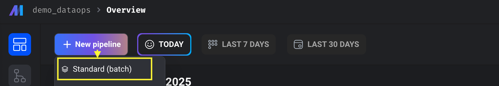
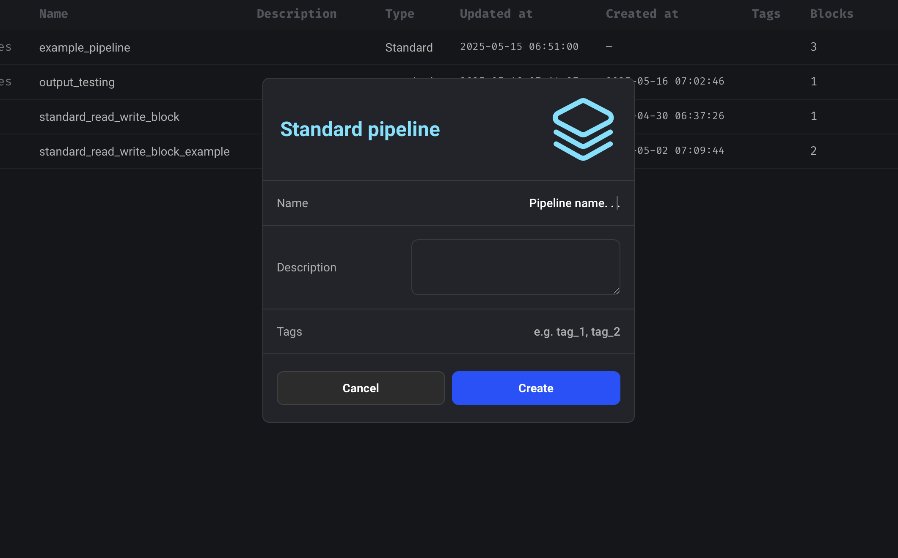
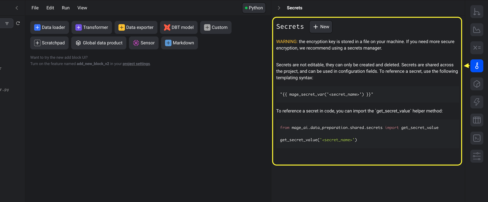
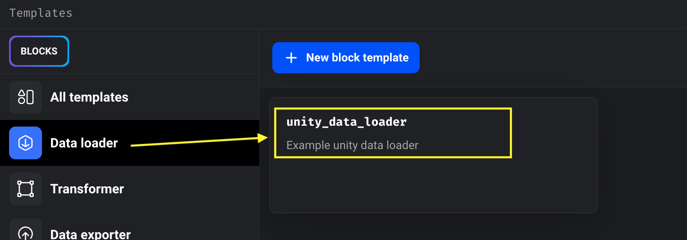
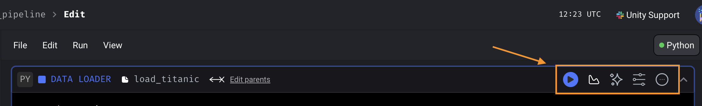

# Writing First Pipeline

## Creating new pipeline

From dashboard home or pipelines page select New Pipeline. Let’s start
with Standard batch.



Add pipeline name, description and tags. Only name is mandatory. Select
create. It’ll bring you to created pipeline edit screen



## Editing created pipeline

Once you are landed to pipeline edit screen it’ll offer you to write
pipeline block.



On panel the file browser let’s you list down the files and folders.
Right panel offers pipeline utilities like variables, secrets and
utilities.

### Loader Block

Let’s start with our first data loader block. Later we’ll describe all
the necessary blocks.

Click data loader and select custom template.  
Select ==unity\_data\_loader==.



Give a meaningful name. To organize the blocks in a modular way, append
==**pipeline\_name/**== before block name. It’ll keep the block files into
the corresponding pipelines folder. e.g. `example_pipeline/load_data`  

It’ll populate all the necessary code with examples to load data from
Unity DB or any api.

!!! note "The populated code block may differ from this guide based on your Unity instance, it is suggested to always refer to the code block that is generated in your Unity instance."


```py
    if 'data_loader' not in globals():
        from unity_sdk.engine.decorators import data_loader
    if 'test' not in globals():
        from unity_sdk.engine.decorators import test
    from unity_sdk.engine.config import get_secret

    import pandas as pd
    from unity_sdk.clients import TSClient

    token = get_secret('RAW_DB_TOKEN')
    db = "Raw"


    @data_loader
    def load_data(*args, **kwargs):
        """
        Template code for loading data from any source.

        Returns:
            Anything (e.g. data frame, dictionary, array, int, str, etc.)
        """

        with TSClient(token=token, database=db) as client:
            query = """SELECT *
                    FROM "water_quality_lab_measurements_v2"
                    limit 100"""
            table = client.read(query, mode="all")
            df = table.to_pandas()

        return df


    @test
    def test_output(output, *args) -> None:
        """
        Template code for testing the output of the block.
        """
        assert output is not None, 'The output is undefined'
```

Use the right top toolbar to execute the block, visualize block output,
manage variables and adjust block settings



Whatever returned from the loader block will be passed to the next block
based on block parent settings

!!! warning "Notes on returning output"
    Do not return list.  
    Instead return tuple, dataframe or wrap in another list  
    e.g. `return [ [output_list] ]`

## Transformer Block

Let’s create a transformer block.

Click , select
custom template and select unity\_data\_transformer from the list.

It’ll populate initial transformer code with essential imports and
decorators

```py
    if 'transformer' not in globals():
        from unity_sdk.engine.decorators import transformer
    if 'test' not in globals():
        from unity_sdk.engine.decorators import test

    from {{customer}}_dataops.models.water_quality_lab_measurements import WaterQualityLabMeasurementsModel
    from unity_sdk.utils import model_utils
    import pandas as pd


    @transformer
    def transform(data, *args, **kwargs):
        """
        Template code for a transformer block.

        Add more parameters to this function if this block has multiple parent blocks.
        There should be one parameter for each output variable from each parent block.

        Args:
            data: The output from the upstream parent block
            args: The output from any additional upstream blocks (if applicable)

        Returns:
            Anything (e.g. data frame, dictionary, array, int, str, etc.)
        """
        # Specify your transformation logic here
        df = pd.DataFrame(data)
        df = model_utils.apply_data_types(data, WaterQualityLabMeasurementsModel)

        return data


    @test
    def test_output(output, *args) -> None:
        """
        Template code for testing the output of the block.
        """
        assert output is not None, 'The output is undefined'
```

Returned data gets passed to next block.

## Exporter Block

Let’s create a transformer block.

Click ,
select custom template and select unity\_data\_exporter from the list.

It’ll populate initial exporter code with essential imports and
decorators

```py
    if 'data_exporter' not in globals():
        from unity_sdk.engine.decorators import data_exporter

    from unity_sdk.engine.config import get_secret
    from {{customer}}_dataops.models.water_quality_lab_measurements import WaterQualityLabMeasurementsModel
    from unity_sdk.clients import TSClient
    from unity_sdk.utils import model_utils
    import pandas as pd

    @data_exporter
    def export_data(data, *args, **kwargs):
        """
        Exports data to some source.

        Args:
            data: The output from the upstream parent block
            args: The output from any additional upstream blocks (if applicable)

        Output (optional):
            Optionally return any object and it'll be logged and
            displayed when inspecting the block run.
        """

        TOKEN = get_secret('RND_DB_TOKEN')
        DATABASE = "RnD"

        validation_model = WaterQualityLabMeasurementsModel
        tags = model_utils.get_fields(validation_model, 'tags')
        time = model_utils.get_fields(validation_model, 'time')[0]

        #Prepare Data frame with proper datatypes
        df = model_utils.apply_data_types(data, WaterQualityLabMeasurementsModel)

        #Establish client and write to DB
        try:
            with TSClient(token=TOKEN, database=DATABASE) as client:
                client.write(
                    data=df,
                    data_frame_measurement_name="water_quality_lab_measurements_example",
                    data_frame_tag_columns=tags,
                    data_frame_timestamp_column='time',
                    )

                print("Data inserted successfully.")
        except Exception as e:
            print(e)
```

Exporter block doesn’t return anything. If any errors or exceptions
occurs, It’s better to raise the exception along with logging the
issue.  
Raising exception will halt the operation and mark the pipeline run as
failed.

!!! note

    This settings can be overridden in pipeline settings.
