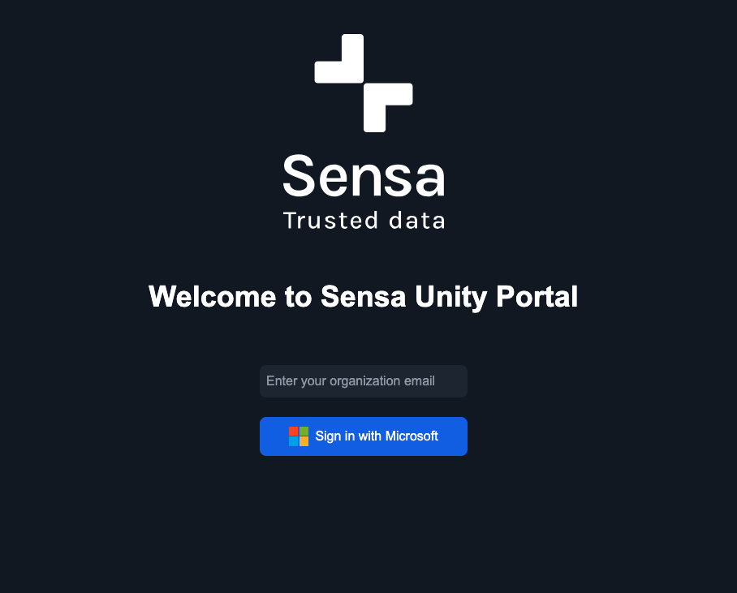
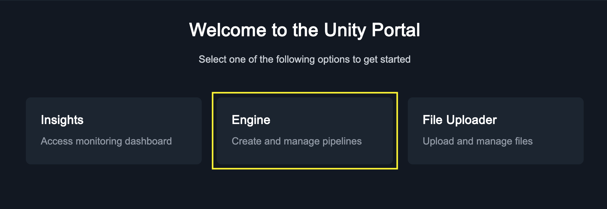
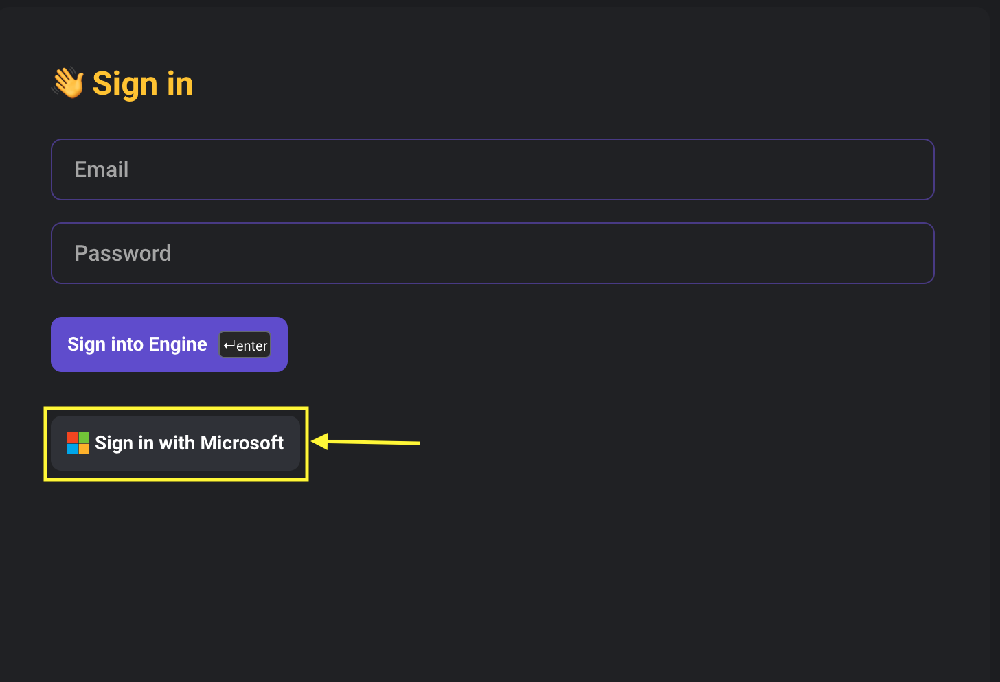

# Unity Engine User Guide
## Introduction
Unity Engine is a data pipeline tool designed to build, run, and manage
ETL (Extract, Transform, Load) workflows easily with a more modern,
intuitive interface.
  

## Login to Unity Engine
Visit ([Sensa Portal](https://portal.sensa.no "Sensa Customer Portal"))
and log in with your Microsoft Entra ID.

Once logged in Please select Engine from the application box.

This’ll take to your engine instance and use your existing logged in
session.  
If you’re logged out please log in again Using Sign in with Microsoft  
  

