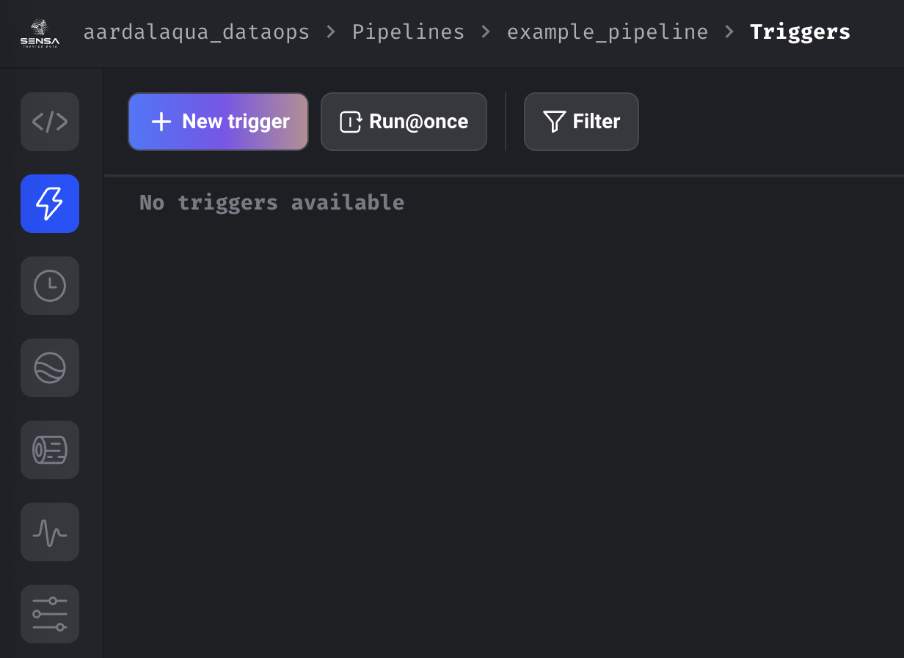
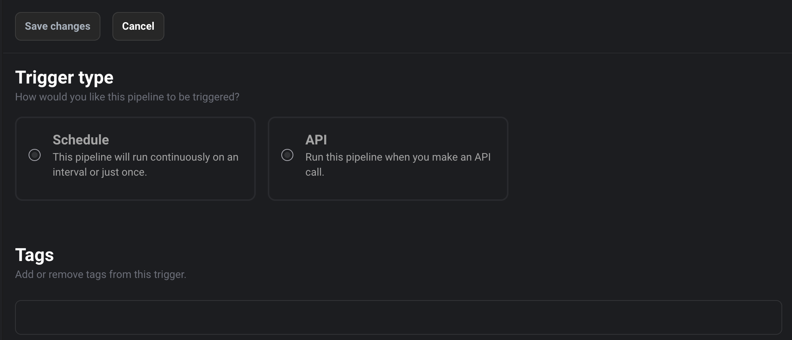
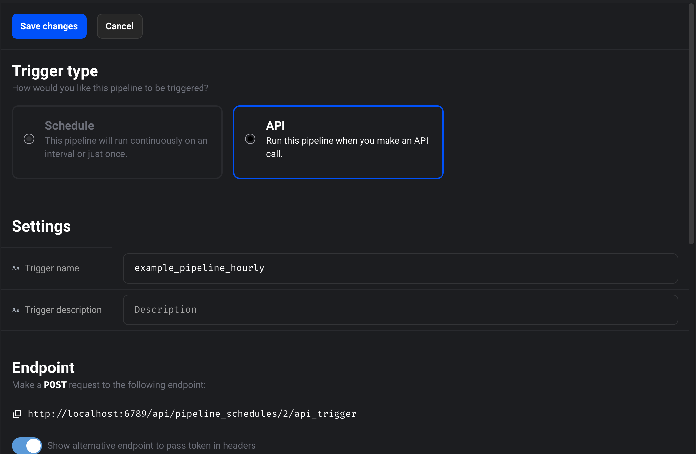
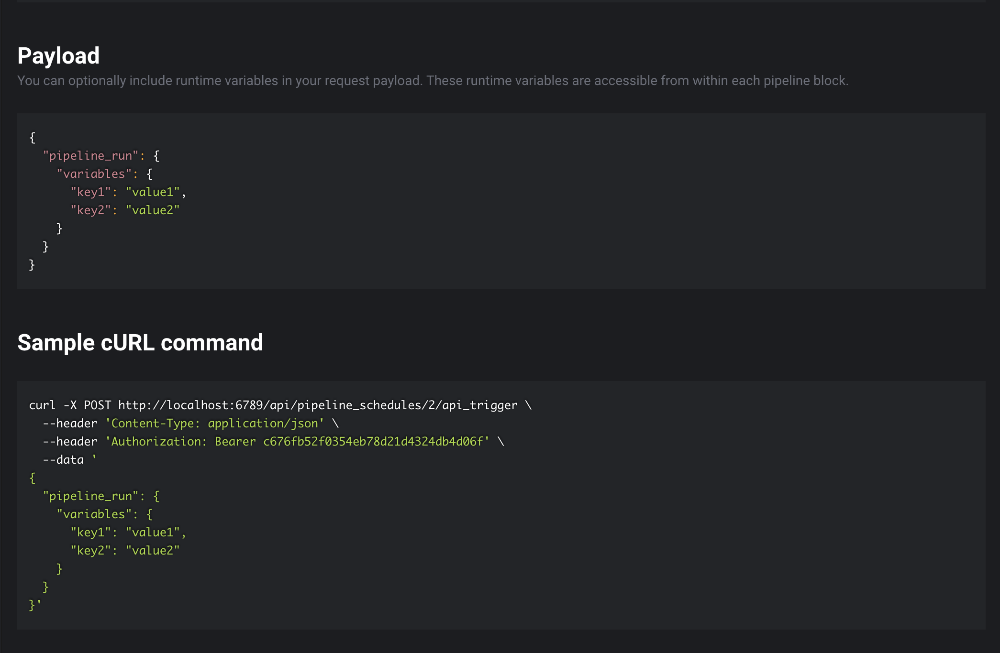
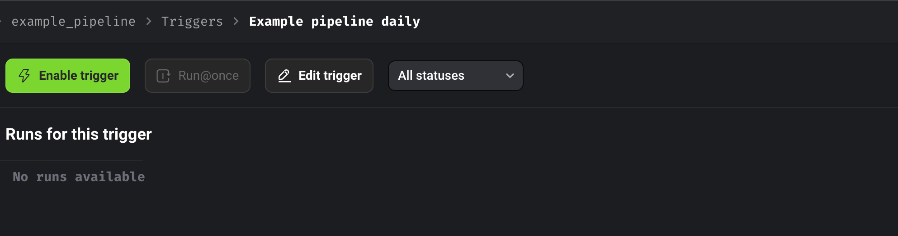

# Scheduling Pipeline Runs

From pipeline list page click any pipeline. It’ll navigation to default
triggers page.

From here you may run once to check if everything is OK.

There’s two ways to schedule a pipeline. Frequency based scheduling or
triggering from API.

## Create pipeline trigger

Click  to add
trigger.

It’ll offer you both schedule and API based trigger.  
  

### Scheduled Trigger

Schedule trigger will let you runs pipeline in frequency based interval.
All the common frequencies are selectable.

To pipeline in custom schedule, select custom. It takes crontab syntax
for frequency.

Always on pipeline auto starts every time once it finishes the current run.

### API Trigger

If you want to invoke a pipeline run from external systems, API trigger is
the way. Selecting API will show the API endpoint and example payloads.

Once schedule is created enable it from triggers list page or trigger
details page.  

